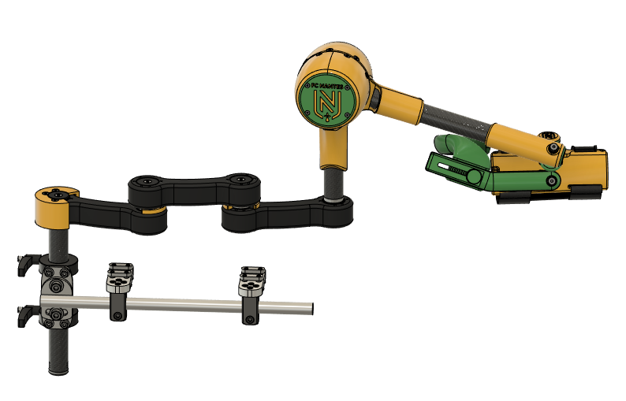
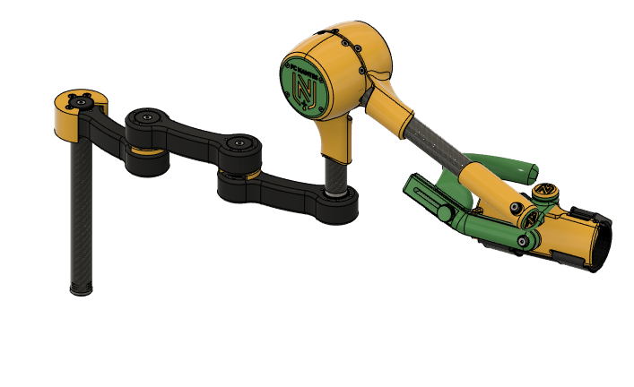
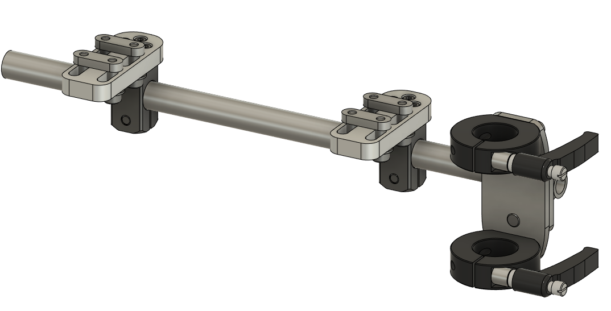

# AT1X ARM SUPPORT

 

This repository contents the documentation of the ORTHOPUS' AT1X Arm Support which is currently under development.

This arm support is a motorized device designed to provide technical assistance to people with disabilities by compensating the upper limb and relieve the user facilitating their motion. It helps the user to reach, grip and handle objects as well as perform activities of daily life.
  
This arm support have 1 free plannar mechanism, 1 actuator-controlled joint and one orthesis.  

The motorized joint receive commands via a 2-buttons remote : one to upper the arm, and one to lower it.

There is also a wheelchair fixation to install the arm support on the wheelchair.

## WARNING NOTICE BEFORE STARTING

The versions of our solutions reproduced in Do It Yourself do not have the CE marking. It can only be applied to solutions developed and sold by ORTHOPUS which follow the regulations in force.
ORTHOPUS cannot guarantee the “quality” of solutions replicated by third parties thanks to documentation shared on github.

## THIS SOLUTION IS UNDER DEVELOPMENT

**AT1X Arm Support is currently under development and provided code & CAD files can include mistakes and necessitate further improvements. The provided files are shared to provide a first overview of the project.**

🧐 *Tip : open the image in a new tab to view the arm support in Fusion 360 viewer*

🧐 *Tip : open the image in a new tab to view the wheelchair fixation in Fusion 360 viewer*

## CONTRIBUTION

Your contribution to these projects is welcome!

* Have you discovered a bug or you have an improvement ideas ?
  * Go to the GitHub [issues](https://github.com/orthopus/02-at1x/issues) of the project.
* You have time, some Maker skills and you want to help us ?
  * Read the [CONTRIBUTING](CONTRIBUTING.md) file to help us to upgrade this project
  * Read the [CODEOFCONDUCT](CODEOFCONDUCT.md) file to know community standards

## CONTACT

If you wish to contact us, you can send a message to contact@orthopus.com
